<!--
  ~ Copyright (c) 2018 BNY Mellon and others.
  ~ All rights reserved. This program and the accompanying materials
  ~ are made available under the terms of the Eclipse Public License v1.0
  ~ and Eclipse Distribution License v. 1.0 which accompany this distribution.
  ~ The Eclipse Public License is available at http://www.eclipse.org/legal/epl-v10.html
  ~ and the Eclipse Distribution License is available at
  ~ http://www.eclipse.org/org/documents/edl-v10.php.
  -->
 <!-- .element style="background-color:white" -->

API Design: Eclipse Collections
-------------------------------

* **space:** next page
* **down arrow:** next page in the current section
* **right arrow:** next section


Agenda
------
 * What is Eclipse Collections?
 * Design Goals
 * Symmetric Sympathy
 * Strategies  for evolving a Collections API
 * Memory Efficiency
 * Performance Optimization Strategies
 * New Features in Eclipse Collections 9.x
 * How did we get here?
 * The Past and the Future


What is Eclipse Collections?
----------------------------
* An open source Java Collections Framework
  * Functional, Fluent, Friendly and Fun
  * A mature library with an evolutionary design
  * 12+ years of development
* A Brief History
  * Caramel (2005)
    * Internal library developed at Goldman Sachs
  * GS Collections (2012)
    * First open source project from Goldman Sachs
  * [Eclipse Collections](https://www.eclipse.org/collections/) (2015)
    * Moved to the Eclipse Foundation


Project Information
-------------------

* Overview
  * https://projects.eclipse.org/projects/technology.collections
* Project Leads and Committers
  * https://projects.eclipse.org/projects/technology.collections/who


Eclipse Collections Evangelism
------------------------------
* <span style="color:aqua">**Conferences**</span> 
  * QCon New York, Devnexus, JavaOne, JavaDay Tokyo, Devoxx US, JCrete, EclipseCon, EclipseCon Europe, ECOOP, ScalaDays, GOTO Chicago, JVM Language Summit, GIDS
* <span style="color:aqua">**Java User Group Meetups**</span>
  * <span style="color:aqua">*Americas*</span> - NY Java SIG, NY JUG, NJ Java SIG, Pittsburgh JUG, Utah JUG, Delaware JUG
  * <span style="color:aqua">*Europe*</span> - London Java Community, Dublin JUG, Belfast JUG, Edinburgh JUG, Manchester JC, West Midlands JUG
  * <span style="color:aqua">*Asia*</span> - JJUG CCC, Benaluru JUG, Chennai JUG, Delhi-NCR JUG, Hyderabad JUG, Kerala JUG   


Design Goals
---------------
* Rich “Functional, fluent and fun” API
  * Eager, Lazy, Serial, Parallel
* Memory efficient data structures
* Optimized algorithms
* Java Interoperability
  * Java container types, Streams 
* Immutability
* Missing Types
  * Intervals, Stacks, Bags, Multimaps, BiMaps
* Primitive Containers


Eclipse Collections Today
-------------------------
* [Open for contribution](https://github.com/eclipse/eclipse-collections/blob/master/CONTRIBUTING.md) at the Eclipse Foundation
* Symmetry drives the design
* Interoperability w/ Java 8 and Java 9

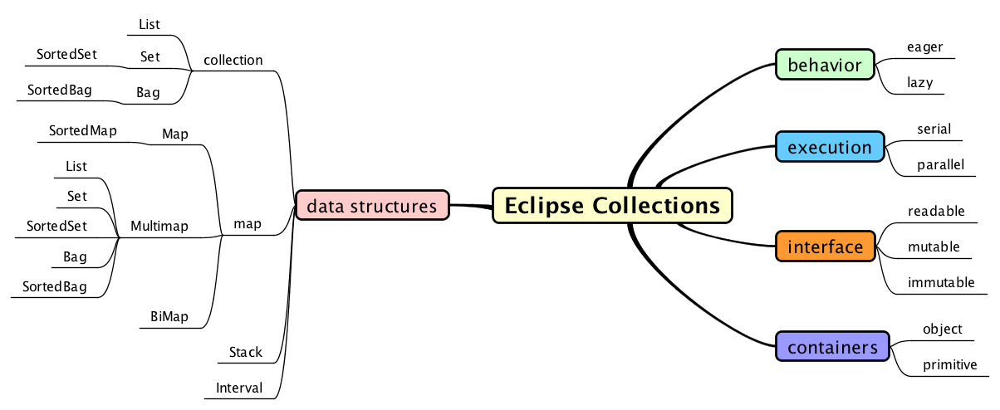


Symmetric Sympathy
------------------

* Blogs about Symmetry
  * [Symmetric Sympathy](https://medium.com/@donraab/symmetric-sympathy-2c59d4541d60)
  * [As a matter of Factory - Part 1](https://medium.com/@donraab/as-a-matter-of-factory-part-1-mutable-75cc2c5d72d9)
  * [As a matter of Factory - Part 2](https://medium.com/@donraab/as-a-matter-of-factory-part-2-immutable-8cb72ff897ee)
  * [Zip Symmetry](https://medium.com/@donraab/zip-symmetry-a857a934ee26)
  * [A rose by any other name...](https://medium.com/@donraab/a-rose-by-any-other-name-e15060d4c98e)
  * [Lazy and Inexhaustible](https://medium.com/@donraab/lazy-and-inexhaustible-f41ffda857dc)
  * [Preposition Preference](https://medium.com/@donraab/preposition-preference-1f1c709b098b)
  * [By yourself some time](https://medium.com/@donraab/preposition-preference-1f1c709b098b)


Symmetry: Protocols and Interfaces
----------------------------------

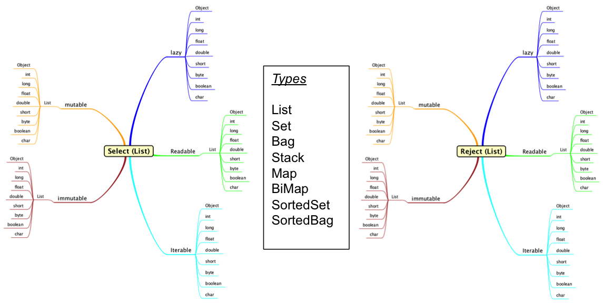 <!-- .element style="background-color:white" -->


#### Symmetric Sympathy - Part 1
| <span style="color:aqua">**API**</span> | <span style="color:aqua">**Eager**</span> | <span style="color:aqua">**Lazy**</span> | <span style="color:aqua">**Parallel**</span> | <span style="color:aqua">**Eager(p)**</span> | <span style="color:aqua">**Lazy(p)**</span> |
| -------- | ------ | ------ | -------- | --------- | --------- |
| [```select```](https://medium.com/@donraab/ec-by-example-filtering-4f14b906f718) | co* | Lazy | co* | co* | Lazy |
| [```reject```](https://medium.com/@donraab/ec-by-example-filtering-4f14b906f718) | co* | Lazy | co* | co* | Lazy |
| [```collect```](https://medium.com/@donraab/ec-by-example-collect-262a46030c49) | co* | Lazy | co* | co* | Lazy |
| [```detect```](https://medium.com/@donraab/ec-by-example-short-circuiting-methods-e60121bc5a) | T | T | T | Primitive | Primitive |
| ```injectInto``` | R | R | ~~N/A~~ | R | R |
| [```any/all/none```](https://medium.com/@donraab/ec-by-example-short-circuiting-methods-e60121bc5a) | boolean | boolean | boolean | boolean | boolean |
| ```toSet``` | mSet | mSet | mSet | m(p)Set | m(p)Set |
| ```toBag``` | mBag | mBag | mSet | m(p)Bag | m(p)Bag |
| ```toList``` | mList | mList | mList | m(p)List | m(p)List |

co*=covariant, m=mutable, p=primitive  


#### Symmetric Sympathy - Part 2
| <span style="color:aqua">**API**</span> | <span style="color:aqua">**Eager**</span> | <span style="color:aqua">**Lazy**</span> | <span style="color:aqua">**Parallel**</span> | <span style="color:aqua">**Eager(p)**</span> | <span style="color:aqua">**Lazy(p)**</span> |
| -------- | ------ | ------ | -------- | --------- | --------- |
| [```flatCollect```](https://medium.com/@donraab/ec-by-example-flatcollect-3efe24e43da2) | co* | Lazy | co* | R | Lazy |
| ```groupBy``` | co* | Multimap | co* | ~~N/A~~ | ~~N/A~~ |
| [```partition```](https://medium.com/@donraab/ec-by-example-partitioning-d2704f826e66) | co* | RI | ~~N/A~~ | ~~N/A~~ | ~~N/A~~ |
| ```chunk``` | RI | RI | ~~N/A~~ | co* | Lazy |
| ```zip``` | co* | Lazy | ~~N/A~~ | co* | ~~N/A~~ |
| ```makeString``` | String | String | String | String | String |
| ```appendString``` | void | void | void | void | void |
| [```count```](https://medium.com/@donraab/ec-by-example-counting-688dfaaf513c) | int | int | int | int | int |
| ```min/max``` | T | T | T | (p) | (p) |

co*=covariant, m=mutable, p=primitive  


API Evolution Strategies
------------------------
| <span style="color:aqua">**Strategy**</span>   | <span style="color:aqua">**Cost**</span> | <span style="color:aqua">**Complexity**</span> |
| ---------- | ---- | ---------- |
| Static Utility | Low   | Low |
| Default methods | Low - Med  | Medium |
| Lazy API | Med - High  | Medium |
| Parallel Utility | Medium  | Med - High |
| Eager API | High  | Medium |
| New Data Type (Object) | High  | Med - High |
| Parallel Lazy API | High  | High |
| New Data Type (Primitive) | High  | High |


Memory Efficiency
-----------------


Memory Efficiency -  Sets
-------------------------

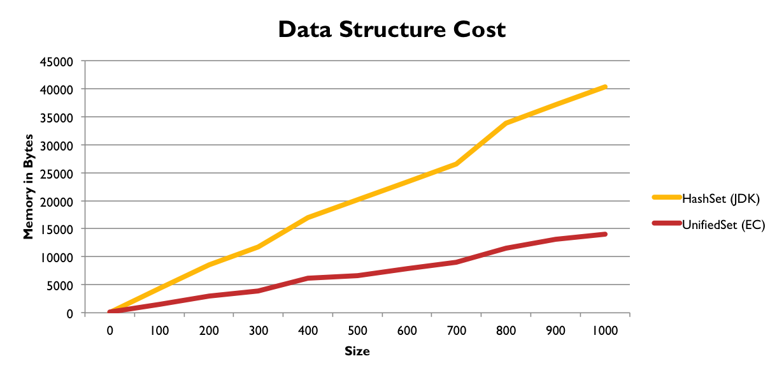 <!-- .element style="background-color:white" -->


Memory Efficiency -  Immutable
------------------------------

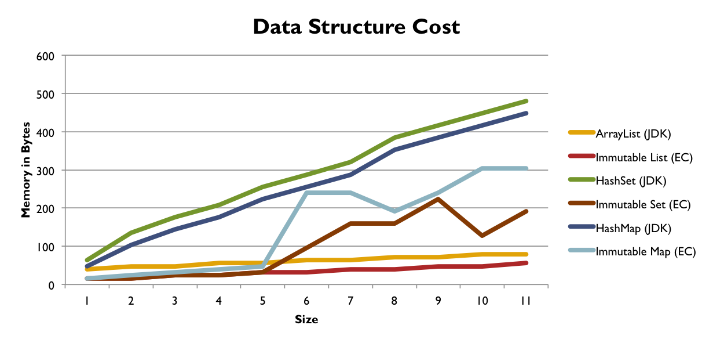 <!-- .element style="background-color:white" -->


Memory Efficiency -  Primitives
-------------------------------

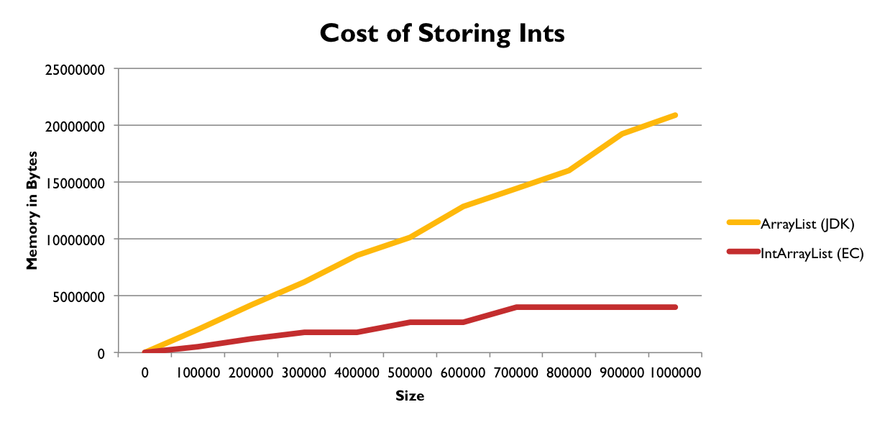 <!-- .element style="background-color:white" -->


Performance Optimization Strategies
-----------------------------------


Object vs. Primitive Performance
--------------------------------
* <span style="color:aqua">Use Cases:</span> Filter, Map, Sum, Filter/Map/Sum
* <span style="color:aqua">Data:</span> 1 Million Ints
* <span style="color:aqua">Processor Name:</span> 12-Core Intel Xeon E5
* <span style="color:aqua">Processor Speed:</span> 2.7 GHz
* <span style="color:aqua">Number of Processors:</span> 1
* <span style="color:aqua">Total Number of Cores:</span> 12
* <span style="color:aqua">L2 Cache (per Core):</span> 256 KB
* <span style="color:aqua">L3 Cache:</span> 30 MB
* <span style="color:aqua">Memory:</span> 64 GB
* <span style="color:aqua">Unit of Measure:</span> Operations per second


#### Object vs. Primitive - Filter Evens

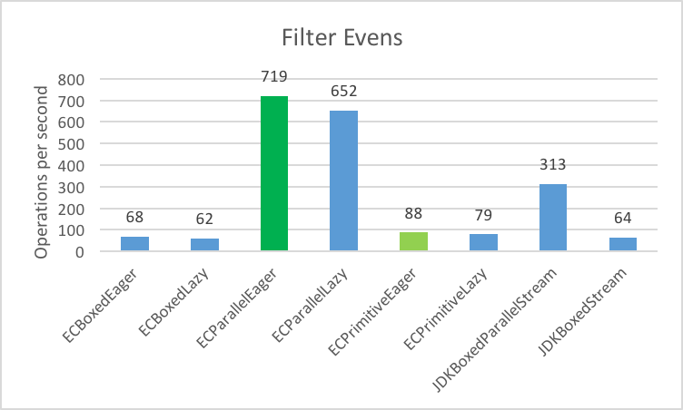

* Use case: Filter evens into new List
* Larger numbers are better


#### Object vs. Primitive - Map x 2

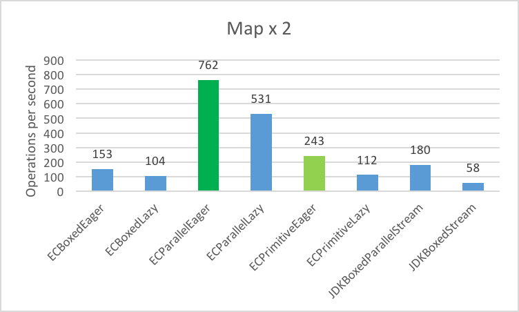

* Use case: Multiply each x 2 and return result in new List
* Larger numbers are better


#### Object vs. Primitive - Sum

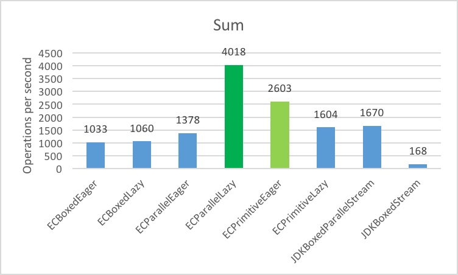

* Use case: Sum all of the numbers
* Larger numbers are better


#### Object vs. Primitive - Filter, Map, Sum

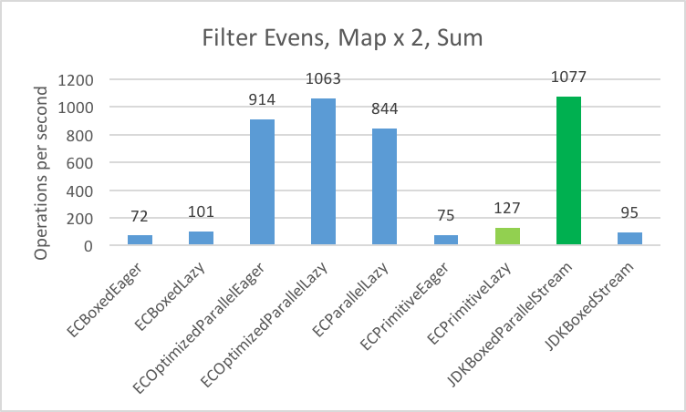

* Use case: Filter evens, Map x 2, Sum
* Larger numbers are better


New in Eclipse Collections 9.2
------------------------------
* RichIterable
    * [```flatCollectWith```](http://www.eclipse.org/collections/javadoc/10.0.0/org/eclipse/collections/api/RichIterable.html#flatCollectWith-org.eclipse.collections.api.block.function.Function2-P-)
    * [```toSortedMapBy```](http://www.eclipse.org/collections/javadoc/10.0.0/org/eclipse/collections/api/RichIterable.html#toSortedMapBy-org.eclipse.collections.api.block.function.Function-org.eclipse.collections.api.block.function.Function-org.eclipse.collections.api.block.function.Function-) 
* Bag
    * [```selectDuplicates```](http://www.eclipse.org/collections/javadoc/10.0.0/org/eclipse/collections/api/bag/Bag.html#selectDuplicates--)
    * [```selectUnique```](http://www.eclipse.org/collections/javadoc/10.0.0/org/eclipse/collections/api/bag/Bag.html#selectUnique--)
* [```chunk```](http://www.eclipse.org/collections/javadoc/10.0.0/org/eclipse/collections/api/IntIterable.html#chunk-int-) (all primitive iterables)
* [```newEmpty```](http://www.eclipse.org/collections/javadoc/10.0.0/org/eclipse/collections/api/collection/primitive/MutableIntCollection.html#newEmpty--) (all mutable primitive collections)
* Implemented [```OrderedMapAdapter```](http://www.eclipse.org/collections/javadoc/10.0.0/org/eclipse/collections/impl/map/ordered/mutable/OrderedMapAdapter.html)
* Collectors2
    * [```aggregateBy```](http://www.eclipse.org/collections/javadoc/10.0.0/org/eclipse/collections/impl/collector/Collectors2.html#aggregateBy-org.eclipse.collections.api.block.function.Function-org.eclipse.collections.api.block.function.Function0-org.eclipse.collections.api.block.function.Function2-java.util.function.Supplier-)
    * [```countByEach```](http://www.eclipse.org/collections/javadoc/10.0.0/org/eclipse/collections/impl/collector/Collectors2.html#countByEach-org.eclipse.collections.api.block.function.Function-)
* ```MultiReader``` factories on ```Sets``` and ```Bags```


New in Eclipse Collections 9.1
------------------------------
* [```collectWithIndex```](http://www.eclipse.org/collections/javadoc/10.0.0/org/eclipse/collections/api/ordered/OrderedIterable.html#collectWithIndex-org.eclipse.collections.api.block.function.primitive.ObjectIntToObjectFunction-R-)
* [```zip```](http://www.eclipse.org/collections/javadoc/10.0.0/org/eclipse/collections/api/list/primitive/IntList.html#zip-java.lang.Iterable-) (primitive lists)
* [```removeIf```](http://www.eclipse.org/collections/javadoc/10.0.0/org/eclipse/collections/api/collection/primitive/MutableIntCollection.html#removeIf-org.eclipse.collections.api.block.predicate.primitive.IntPredicate-) (primitive collections)
* ```putPair``` (primitive maps)
* Collectors2
    * [```countBy```](http://www.eclipse.org/collections/javadoc/10.0.0/org/eclipse/collections/impl/collector/Collectors2.html#countBy-org.eclipse.collections.api.block.function.Function-)
    * [```groupByEach```](http://www.eclipse.org/collections/javadoc/10.0.0/org/eclipse/collections/impl/collector/Collectors2.html#groupByEach-org.eclipse.collections.api.block.function.Function-java.util.function.Supplier-)
    * [```groupByUniqueKey```](http://www.eclipse.org/collections/javadoc/10.0.0/org/eclipse/collections/impl/collector/Collectors2.html#groupByUniqueKey-org.eclipse.collections.api.block.function.Function-java.util.function.Supplier-)
* ```MultiReaderList``` factory on ```Lists```
* New Factory class for [```Strings```](http://www.eclipse.org/collections/javadoc/10.0.0/org/eclipse/collections/impl/factory/Strings.html)


New in Eclipse Collections 9.0
------------------------------
* Java 9
  * Automatic Module Naming
  * Searchable [Javadocs](http://www.eclipse.org/collections/javadoc/10.0.0/overview-summary.html) (finally!!!!)
* New Features
  * [```countBy```](http://www.eclipse.org/collections/javadoc/10.0.0/org/eclipse/collections/api/RichIterable.html#countBy-org.eclipse.collections.api.block.function.Function-)
  * [```distinctBy```](http://www.eclipse.org/collections/javadoc/10.0.0/org/eclipse/collections/api/list/ListIterable.html#distinctBy-org.eclipse.collections.api.block.function.Function-)
  * Factories for Primitive Streams
  * ImmutableCollection
    * [```stream```](http://www.eclipse.org/collections/javadoc/10.0.0/org/eclipse/collections/api/collection/ImmutableCollection.html#stream--)
    * [```parallelStream```](http://www.eclipse.org/collections/javadoc/10.0.0/org/eclipse/collections/api/collection/ImmutableCollection.html#parallelStream--)


CountBy
-------
```java
// Eclipse Collections 7.x - 8.x

MutableBag<String> countsOld =
        this.company.getCustomers()
                .asLazy().collect(Customer::getCity).toBag();

```
---
```java
// Eclipse Collections 9.x

MutableBag<String> countsNew =
        this.company.getCustomers()
                .countBy(Customer::getCity);

```


DistinctBy
----------
```java
// Eclipse Collections 7.x - 8.x

MutableList<Customer> distinctOld =
        this.company.getCustomers()
                .distinct(HashingStrategies
                              .fromFunction(Customer::getCity));

```
---
```java
// Eclipse Collections 9.x

MutableList<Customer> distinctNew =
        this.company.getCustomers()
                .distinctBy(Customer::getCity);

```


Factories for Primitive Streams
-------------------------------
```java
// Eclipse Collections 7.x - 8.x

MutableIntList listOld =
        IntStream.rangeClosed(1, 100)
                .collect(IntLists.mutable::empty,
                         MutableIntList::add,
                         MutableIntList::withAll);

```
---
```java
// Eclipse Collections 9.x

MutableIntList listNew =
        IntLists.mutable.withAll(
                IntStream.rangeClosed(1, 100));   

```


Stream on Immutable Collections
-------------------------------
```java
// Eclipse Collections 7.x - 8.x

boolean result =
        Lists.immutable.with(1, 2, 3)
                .castToList()
                .stream()
                .anyMatch(i -> i % 2 == 0);

```
---
```java
// Eclipse Collections 9.x

boolean result =
        Lists.immutable.with(1, 2, 3)
                .stream()
                .anyMatch(i -> i % 2 == 0);

```


ImmutableList API Design
------------------------
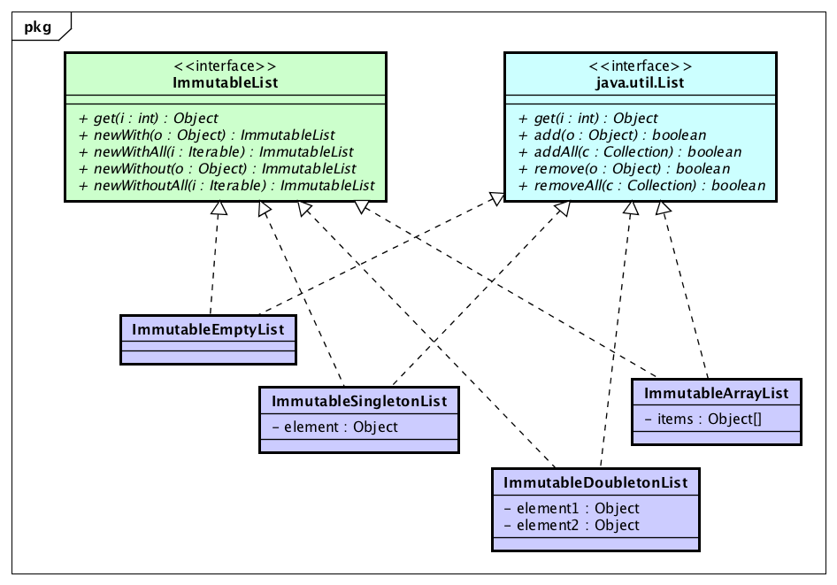 <!-- .element style="width: 75%;background-color:white" -->

Structural and Contractual Immutability


How did we get here?
--------------------
* Once upon a time...


An old dude who knows Smalltalk
-------------------------------
* Clipper / CA-Visual Objects (‘90 –‘95)
  * Arrays
  * Code Blocks
    * ```{ |each| expression }```
* IBM VisualAge Smalltalk (‘94 – ‘00)
  * Collections
  * Code Blocks
    * ```[ :each | expression ]```


Smalltalk-80 Collection Hierarchy
---------------------------------

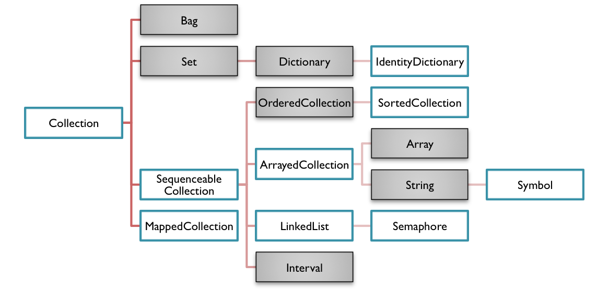 <!-- .element style="background-color:white" -->

"It's turtles all the way down"


Smalltalk Collection Factories
------------------------------
```smalltalk
|set list bag array string map interval|

set := Set with: 1 with: 2 with: 3 with: 4.
list := OrderedCollection with: 1 with: 2 with: 3 with: 4. 
bag := Bag with: 1 with: 2 with: 3 with: 4.

array := #( 1 2 3 4 ).

string := ‘The Quick Brown Fox jumps over a lazy dog.’.

map := Dictionary newFromPairs: #( 1 ‘1’ 2 ‘2’ 3 ‘3’ 4 ‘4’).

interval := 1 to: 4.
```


Smalltalk Protocols (Eager)
---------------------------
```smalltalk
set select: [ :each | each odd ].         // Set(1 3)
list reject: [ :each | each even].        // OrderedCollection(1 3)
array collect: [ :each | each asString].  // #(‘1’ ‘2’ ‘3’ ‘4’)

string detect: [ :c | c isLowercase].     // $h
map inject: '' into: [ :r :s | r, s].     // ‘1234’

string anySatisfy: [ :c | c = $e].        // true
set allSatisfy: [ :each | each < 5 ].     // true
map noneSatisfy: [ :s | s isString ].     // false

interval asSet.                           // Set(1 2 3 4)
map asBag.                                // Bag(‘1’ ‘2’ ‘3’ ‘4’) 
list asArray.                             // #(1 2 3 4)
```


Smalltalk + Java = Eclipse Collections
--------------------------------------
| <span style="color:aqua">**Smalltalk Influenced**</span>   | <span style="color:aqua">**Java Influenced**</span> |
| ---------- | ---------- |
| Symmetry | Basic Collection Types |
| Blocks (Lambdas) | Primitive Collections |
| Internal Iterators | Lazy Iterables |
| Protocol Naming | Parallelism |
| Eager APIs | Immutability |
| Bag, Interval | Multimap, BiMap |
| Factory Methods |  |


Designing API Names
-------------------
* Naming is hard 
  * You can't make everyone happy
* Choose a naming influence style
  * I chose Smalltalk as my influence
* Find patterns of implementation and name them
  * Does your name communicate well?
  * Get opinions of others
* Stick to your patterns and names - be consistent!


Primary API Comparison
----------------------
| <span style="color:aqua">**Eclipse Collections**</span> | <span style="color:aqua">**Java 8 Streams**</span> |
|  ---- | ---------- |
| [```select```](https://www.eclipse.org/collections/javadoc/10.0.0/org/eclipse/collections/api/RichIterable.html#select-org.eclipse.collections.api.block.predicate.Predicate-)   | ```filter``` |
| [```reject```](https://www.eclipse.org/collections/javadoc/10.0.0/org/eclipse/collections/api/RichIterable.html#reject-org.eclipse.collections.api.block.predicate.Predicate-)  | ```filter``` (!) |
| [```collect```](https://www.eclipse.org/collections/javadoc/10.0.0/org/eclipse/collections/api/RichIterable.html#collect-org.eclipse.collections.api.block.function.Function-)  | ```map``` |
| [```flatCollect```](https://www.eclipse.org/collections/javadoc/10.0.0/org/eclipse/collections/api/RichIterable.html#flatCollect-org.eclipse.collections.api.block.function.Function-) | ```flatMap``` |
| [```detect```](https://www.eclipse.org/collections/javadoc/10.0.0/org/eclipse/collections/api/RichIterable.html#detect-org.eclipse.collections.api.block.predicate.Predicate-)  | ```filter().findFirst().orElse(null)``` |
| [```detectIfNone```](http://www.eclipse.org/collections/javadoc/10.0.0/org/eclipse/collections/api/RichIterable.html#detectIfNone-org.eclipse.collections.api.block.predicate.Predicate-org.eclipse.collections.api.block.function.Function0-)  | ```filter().findFirst().orElseGet()``` |
| [```detectOptional```](http://www.eclipse.org/collections/javadoc/10.0.0/org/eclipse/collections/api/RichIterable.html#detectOptional-org.eclipse.collections.api.block.predicate.Predicate-)  | ```filter().findFirst()``` |
| [```count```](https://www.eclipse.org/collections/javadoc/10.0.0/org/eclipse/collections/api/RichIterable.html#detect-org.eclipse.collections.api.block.predicate.Predicate-)  | ```filter().count()``` |
| [```injectInto```](https://www.eclipse.org/collections/javadoc/10.0.0/org/eclipse/collections/api/RichIterable.html#injectInto-IV-org.eclipse.collections.api.block.function.Function2-) | ```reduce``` |
| [```any```](https://www.eclipse.org/collections/javadoc/10.0.0/org/eclipse/collections/api/RichIterable.html#anySatisfy-org.eclipse.collections.api.block.predicate.Predicate-)/[```all```](https://www.eclipse.org/collections/javadoc/10.0.0/org/eclipse/collections/api/RichIterable.html#allSatisfy-org.eclipse.collections.api.block.predicate.Predicate-)/[```noneSatisfy```](https://www.eclipse.org/collections/javadoc/10.0.0/org/eclipse/collections/api/RichIterable.html#noneSatisfy-org.eclipse.collections.api.block.predicate.Predicate-) | ```any/all/noneMatch``` |


Advanced API Comparison
-----------------------
| <span style="color:aqua">**Eclipse Collections**</span> | <span style="color:aqua">**Java 8 Streams**</span> |
|  ---- | ---------- |
| [```groupBy```](https://www.eclipse.org/collections/javadoc/10.0.0/org/eclipse/collections/api/RichIterable.html#groupBy-org.eclipse.collections.api.block.function.Function-R-) | ```collect(Collectors.groupingBy)``` |
| [```countBy```](https://www.eclipse.org/collections/javadoc/10.0.0/org/eclipse/collections/api/RichIterable.html#countBy-org.eclipse.collections.api.block.function.Function-) | ```collect(Collectors.groupingBy(Collectors.counting))``` |
| [```aggregateBy```](https://www.eclipse.org/collections/javadoc/10.0.0/org/eclipse/collections/api/RichIterable.html#aggregateBy-org.eclipse.collections.api.block.function.Function-org.eclipse.collections.api.block.function.Function0-org.eclipse.collections.api.block.function.Function2-) | ```collect(Collectors.groupingBy(Collectors.reducing))``` |
| [```minByOptional```](https://www.eclipse.org/collections/javadoc/10.0.0/org/eclipse/collections/api/RichIterable.html#minByOptional-org.eclipse.collections.api.block.function.Function-) | ```min(Comparator.comparing)``` |
| [```maxByOptional```](https://www.eclipse.org/collections/javadoc/10.0.0/org/eclipse/collections/api/RichIterable.html#maxByOptional-org.eclipse.collections.api.block.function.Function-) | ```max(Comparator.comparing)``` |
| [```distinct```](https://www.eclipse.org/collections/javadoc/10.0.0/org/eclipse/collections/api/ordered/OrderedIterable.html#distinct--)| ```distinct.collect(Collectors.toList)``` |
| [```partition```](https://www.eclipse.org/collections/javadoc/10.0.0/org/eclipse/collections/api/RichIterable.html#partition-org.eclipse.collections.api.block.predicate.Predicate-) | ```collect(Collectors.partitioningBy)``` |
| [```chunk```](https://www.eclipse.org/collections/javadoc/10.0.0/org/eclipse/collections/api/RichIterable.html#chunk-int-) | ~~N/A~~ |
| [```zip```](https://www.eclipse.org/collections/javadoc/10.0.0/org/eclipse/collections/api/ordered/OrderedIterable.html#zip-java.lang.Iterable-) | ~~N/A~~ |
| [```makeString```](https://www.eclipse.org/collections/javadoc/10.0.0/org/eclipse/collections/api/RichIterable.html#makeString-java.lang.String-java.lang.String-java.lang.String-) | ```collect(Collectors.joining)``` |


Eclipse Collections Factories
-----------------------------
```java
MutableSet<Integer> set = Sets.mutable.with(1, 2, 3, 4);
MutableList<Integer> list = Lists.mutable.with(1, 2, 3, 4); 
MutableBag<Integer> bag = Bags.mutable.with(1, 2, 3, 4);

MutableList<Integer> array = ArrayAdapter.adapt(1, 2, 3, 4);

CharAdapter string = 
    CharAdapter.adapt("The Quick Brown Fox jumps over a lazy dog.");

MutableMap<Integer, String> map := 
    Maps.mutable.with(1, "1", 2, "2", 3, "3", 4, "4").

Interval interval = Interval.oneTo(4);
```


Eclipse Collections (Eager)
---------------------------
```java
set.select(each -> each % 2 == 1);         // Set(1 3)
list.reject(each -> each % 2 == 0);        // List(1 3)
array.collect(Object::toString);           // List("1" "2" "3" "4")

bag.detect(each -> each < 2);              // Integer.valueOf(1)
map.injectInto("", (r, s) -> r + s);       // "1234"

string.anySatisfy(c -> c == 'e');          // true
set.allSatisfy(each -> each < 5);          // true
map.noneSatisfy(String.class::isInstance); // false

interval.toSet();                          // Set(1 2 3 4)
map.toBag();                               // Bag("1" "2" "3" "4")
set.toList();                              // List(1 2 3 4)
```


Eclipse Collections (Lazy)
--------------------------
```java
set.asLazy().select(each -> each % 2 == 1);    // Set(1 3)
list.asLazy().reject(each -> each % 2 == 0);   // List(1 3)
array.asLazy().collect(Object::toString);      // List("1" "2" "3" "4")

bag.asLazy().detect(each -> each < 2);         // Integer.valueOf(1)
map.asLazy().injectInto("", (r, s) -> r + s);  // "1234"

string.asLazy().anySatisfy(c -> c == 'e');          // true
set.asLazy().allSatisfy(each -> each < 5);          // true
map.asLazy().noneSatisfy(String.class::isInstance); // false

interval.asLazy().toSet();                     // Set(1 2 3 4)
map.asLazy().toBag();                          // Bag("1" "2" "3" "4")
set.asLazy().toList();                         // List(1 2 3 4)
```


The Past
--------
* Memory efficient Small Collections (2004)
* Java 5 - Generics (2005)
* Open Source GS Collections (2012)
  * [7 Major Releases](https://github.com/goldmansachs/gs-collections/releases) 
* Java 8 - Lambdas (2014)
* Eclipse Collections (2015) 
  * [3 Major Releases](https://github.com/eclipse/eclipse-collections/releases) 


The Future
----------
* Modularization
* Improve Symmetry
  * Object / Primitive
* New Data Structures
  * More Primitive, Ordered, Trees, Persistent Structures, Off-heap
* Continued Java integration and inter-op
* Integrate with Eclipse Build Train


Appendix
--------


Static Utility - [Iterate](https://www.eclipse.org/collections/javadoc/10.0.0/org/eclipse/collections/impl/utility/Iterate.html) (Eager)
--------------------------------
```java
Iterate.select(Iterable, Predicate);              // Collection
Iterate.reject(Iterable, Predicate);              // Collection
Iterate.collect(Iterable, Function);              // Collection

Iterate.detect(Iterable, Predicate);              // Object
Iterate.injectInto(Iterable, Object, Function2);  // Object

Iterate.anySatisfy(Iterable, Predicate);          // boolean
Iterate.allSatisfy(Iterable, Predicate);          // boolean
Iterate.noneSatisfy(Iterable, Predicate);         // boolean

Iterate.toArray(Iterable);                        // Object[]
Iterate.toMap(Iterable, Function, Function);      // Map
```


Static Utility - [ListIterate](https://www.eclipse.org/collections/javadoc/10.0.0/org/eclipse/collections/impl/utility/ListIterate.html) (Eager)
------------------------------------
```java
ListIterate.select(List, Predicate);              // MutableList
ListIterate.reject(List, Predicate);              // MutableList
ListIterate.collect(List, Function);              // MutableList

ListIterate.detect(List, Predicate);              // Object
ListIterate.injectInto(List, Object, Function2);  // Object

ListIterate.anySatisfy(List, Predicate);          // boolean
ListIterate.allSatisfy(List, Predicate);          // boolean
ListIterate.noneSatisfy(List, Predicate);         // boolean

ListIterate.toArray(List);                        // Object[]
ListIterate.toMap(List, Function, Function);      // Map
```


Eclipse Collections Primitive (Eager)
-------------------------------------
```java
set.select(each -> each % 2 == 1);         // IntSet(1 3)
list.reject(each -> each % 2 == 0);        // IntList(1 3)
bag.collect(Object::toString);             // Bag("1" "2" "3" "4")

string.detect(Character::isLowerCase);     // 'h'
map.injectInto("", (r, s) -> r + s);       // "1234"

string.anySatisfy(c -> c == 'e');          // true
set.allSatisfy(each -> each < 5);          // true
map.noneSatisfy(String.class::isInstance); // false

interval.toSet();                          // IntSet(1 2 3 4)
map.toBag();                               // IntBag(1 2 3 4)
set.toList();                              // IntList(1 2 3 4)
```


Eclipse Collections Primitive (Lazy)
------------------------------------
```java
set.asLazy().select(each -> each % 2 == 1);  // LazyIntIterable
list.asLazy().reject(each -> each % 2 == 0); // LazyIntIterable
bag.asLazy().collect(Object::toString);      // LazyIterable

string.asLazy().detect(Character::isLowerCase); // 'h'
map.asLazy().injectInto("", (r, s) -> r + s);   // "1234"

string.asLazy().anySatisfy(c -> c == 'e');          // true
set.asLazy().allSatisfy(each -> each < 5);          // true
map.asLazy().noneSatisfy(String.class::isInstance); // false

interval.asLazy().toSet();                    // IntSet(1 2 3 4)
map.asLazy().toBag();                         // IntBag(1 2 3 4)
set.asLazy().toList();                        // IntList(1 2 3 4)
```


Eclipse Collections (Streams)
------------------------------------
```java
set.stream().filter(each -> each % 2 == 1);     // Stream
list.stream().filter(each -> each % 2 != 0);    // Stream
array.stream().map(Object::toString);           // Stream

bag.stream().filter(each -> each < 2).findFirst(); // Optional(1)
map.stream().reduce("", (r, s) -> r + s);          // "1234"

string.chars().anyMatch(c -> c == 'e');            // true
set.stream().allMatch(each -> each < 5);           // true
map.stream().noneMatch(String.class::isInstance);  // false

interval.stream().collect(Collectors.toSet());  // Set(1 2 3 4)
map.stream().collect(Collectors2.toBag());      // Bag(1 2 3 4)
set.stream().collect(Collectors2.toList());     // List(1 2 3 4)
```
